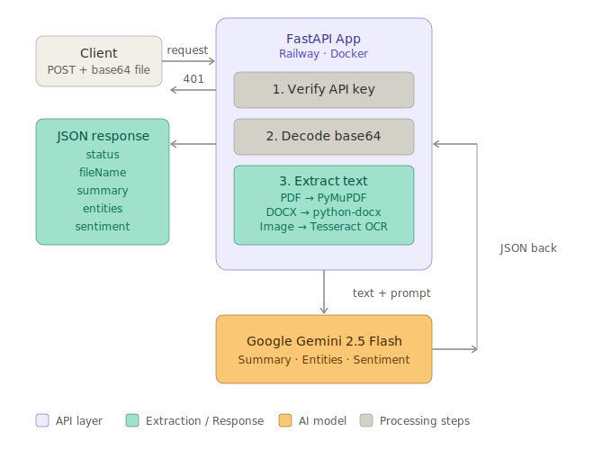

# AI-Powered Document Analysis & Extraction API

> GUVI Hackathon 2026 — Track 2  
> Intelligent document processing system that extracts, analyses, and summarises content from PDF, DOCX, and image files.

---

## Links

|                  |                                                                          |
| ---------------- | ------------------------------------------------------------------------ |
| **Live API**     | https://doc-analyzer-production-1e83.up.railway.app/api/document-analyze |
| **Health Check** | https://doc-analyzer-production-1e83.up.railway.app                      |
| **GitHub**       | https://github.com/AmulyaThammineni/doc-analyzer                         |

---

## Architecture



---

## Key Features

- Multi-format support — PDF, DOCX, Image (OCR)
- AI-powered summarisation using Google Gemini
- Named entity extraction — names, dates, organizations, amounts, locations
- Sentiment analysis — Positive / Neutral / Negative
- API key authentication
- Deployed on Railway with Docker

---

## Tech Stack

| Layer           | Technology                |
| --------------- | ------------------------- |
| Framework       | FastAPI (Python)          |
| PDF Extraction  | PyMuPDF                   |
| DOCX Extraction | python-docx               |
| Image OCR       | Tesseract via pytesseract |
| AI Model        | Google Gemini 2.5 Flash   |
| HTTP Client     | httpx                     |
| Deployment      | Docker on Railway         |

---

## API Reference

### Endpoint

```
POST /api/document-analyze
```

### Request Headers

```
x-api-key: sk_track2_987654321
Content-Type: application/json
```

### Request Body

```json
{
  "fileName": "sample.pdf",
  "fileType": "pdf",
  "fileBase64": "<base64-encoded-file-content>"
}
```

| Field      | Type   | Description                 |
| ---------- | ------ | --------------------------- |
| fileName   | string | Name of the file            |
| fileType   | string | `pdf`, `docx`, or `image`   |
| fileBase64 | string | Base64 encoded file content |

### Success Response

```json
{
  "status": "success",
  "fileName": "sample.pdf",
  "summary": "This document is an invoice from ABC Pvt Ltd to Ravi Kumar dated 10 March 2026 for Rs.10,000.",
  "entities": {
    "names": ["Ravi Kumar"],
    "dates": ["10 March 2026"],
    "organizations": ["ABC Pvt Ltd"],
    "amounts": ["Rs.10,000"],
    "locations": ["Hyderabad"]
  },
  "sentiment": "Neutral"
}
```

### Error Responses

| Status | Meaning                                 |
| ------ | --------------------------------------- |
| 401    | Invalid or missing API key              |
| 400    | Invalid base64 or unsupported file type |
| 422    | No text could be extracted              |
| 500    | AI analysis failed                      |

### Example cURL

```bash
BASE64=$(base64 -w 0 sample.pdf)

curl -X POST https://doc-analyzer-production-1e83.up.railway.app/api/document-analyze \
  -H "Content-Type: application/json" \
  -H "x-api-key: sk_track2_987654321" \
  -d "{\"fileName\": \"sample.pdf\", \"fileType\": \"pdf\", \"fileBase64\": \"$BASE64\"}"
```

---

## Setup Instructions (Local)

### Prerequisites

- Python 3.9+
- Tesseract OCR
- Gemini API key from [Google AI Studio](https://aistudio.google.com/apikey)

### Step 1 — Install Tesseract (Windows)

Download and install from https://github.com/UB-Mannheim/tesseract/wiki  
Default install path: `C:\Program Files\Tesseract-OCR\`

### Step 2 — Clone the repo

```bash
git clone https://github.com/AmulyaThammineni/doc-analyzer.git
cd doc-analyzer
```

### Step 3 — Create virtual environment

```bash
python -m venv venv
venv\Scripts\activate
```

### Step 4 — Install dependencies

```bash
pip install -r requirements.txt
```

### Step 5 — Set environment variables

```bash
cp .env.example .env
```

Edit `.env`:

```
GEMINI_API_KEY=your_gemini_api_key_here
API_KEY=sk_track2_987654321
GEMINI_MODEL=gemini-2.5-flash
```

### Step 6 — Run

```bash
uvicorn src.main:app --host 127.0.0.1 --port 8000 --reload
```

Visit `http://localhost:8000` — should show `{"status":"ok"}`

---

## Streamlit UI (Optional Demo)

This UI is an optional add-on for quick demos and local testing. The core submission is the FastAPI endpoint (`/api/document-analyze`).

### Run the UI

Make sure you have your environment variables set (at minimum `GEMINI_API_KEY`). Then:

```bash
streamlit run streamlit_app.py
```

### Recommended: use `.env` (no manual entry in the UI)

Create a `.env` file in the project root:

```
GEMINI_API_KEY=your_gemini_api_key_here
GEMINI_MODEL=gemini-2.5-flash
```

The Streamlit UI automatically loads `.env`.

---

## Project Structure

```
doc-analyzer/
├── README.md
├── Dockerfile
├── requirements.txt
├── .env.example
├── images/
│   └── architecture.svg
└── src/
    ├── __init__.py
    ├── main.py
    ├── celery_app.py
    └── tasks.py
```

---

## Approach & Strategy

### Text Extraction

- **PDF** — PyMuPDF iterates every page and extracts text with layout preservation
- **DOCX** — python-docx reads all paragraphs and table cells
- **Image** — Tesseract OCR with `--psm 6` mode for document-style text

### AI Analysis

A single Gemini API prompt handles all three tasks at once — summary, entity extraction, and sentiment. This approach is faster and more contextually consistent than making separate API calls.

### Authentication

Every request must include `x-api-key` header. Invalid or missing keys return `401 Unauthorized` immediately.

---

## AI Tools Used

### AI APIs used inside the project

| Tool                    | Purpose                                                       |
| ----------------------- | ------------------------------------------------------------- |
| Google Gemini 2.5 Flash | Document summarisation, entity extraction, sentiment analysis |
| Tesseract OCR           | Text extraction from image files                              |

### AI tools used during development

| Tool               | Purpose                                                        |
| ------------------ | -------------------------------------------------------------- |
| Claude (Anthropic) | Code generation, architecture design, debugging, documentation |
| ChatGPT (OpenAI)   | Debugging assistance, code suggestions                         |

---

## Known Limitations

- Free tier Gemini API has rate limits — may return 429 under heavy load
- Railway free tier may have cold start delays of 10-30 seconds on first request
- Scanned PDFs without embedded text may have lower OCR accuracy
- Documents are truncated to 8000 characters before sending to Gemini

---

## Dependencies

| Package       | Version | Purpose                      |
| ------------- | ------- | ---------------------------- |
| fastapi       | 0.115.0 | Web framework                |
| uvicorn       | 0.30.6  | ASGI server                  |
| PyMuPDF       | 1.24.11 | PDF extraction               |
| python-docx   | 1.1.2   | DOCX extraction              |
| pytesseract   | 0.3.13  | OCR wrapper                  |
| Pillow        | 10.4.0  | Image processing             |
| httpx         | 0.27.2  | HTTP client for Gemini API   |
| python-dotenv | 1.0.1   | Environment variable loading |
